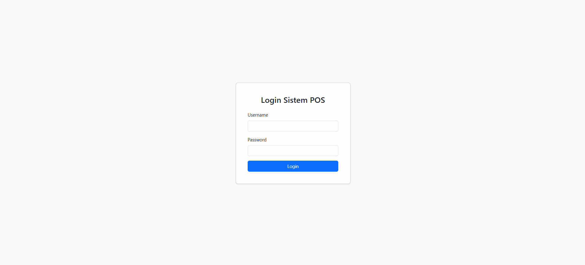

# Sistem POS (Point of Sale) Sederhana

Ini adalah aplikasi Point of Sale (POS) berbasis web yang dibangun secara native menggunakan PHP, JavaScript vanilla, Bootstrap 5, dan MySQL. Aplikasi ini dirancang untuk membantu dalam manajemen penjualan, produk, pengguna, dan laporan transaksi dasar.

## ✨ Kutipan

> *"Aku tidak berilmu; yang berilmu hanyalah DIA. Jika tampak ilmu dariku, itu hanyalah pantulan dari Cahaya-Nya."*

## 🎥 Demo

## Fitur Utama

* **Autentikasi Pengguna:** Sistem login dengan peran Admin dan Kasir.
* **Dashboard:** Halaman utama setelah login (tampilan dasar).
* **Manajemen Produk:**
    * CRUD (Create, Read, Update, Delete) untuk produk.
    * Pengelolaan kategori produk (saat ini data kategori diisi manual atau melalui database).
* **Manajemen Transaksi:**
    * Input penjualan dengan pemilihan produk.
    * Perhitungan total belanja dan kembalian secara dinamis.
    * Penyimpanan data transaksi (header dan detail).
    * Pengurangan stok produk otomatis setelah transaksi.
* **Cetak Struk:** Menampilkan struk transaksi dalam format sederhana yang bisa dicetak.
* **Laporan Transaksi:**
    * Menampilkan daftar transaksi.
    * Filter transaksi berdasarkan rentang tanggal.
    * Export data laporan ke format CSV.
* **Manajemen Pengguna (Khusus Admin):**
    * CRUD (Create, Read, Update, Delete) untuk akun pengguna (Admin/Kasir).
* **Pengaturan Toko (Khusus Admin):**
    * Mengubah informasi toko (nama, alamat, kontak, catatan struk).
    * Mengunggah dan menghapus logo toko.
* **Keamanan Dasar:**
    * Proteksi terhadap SQL Injection (menggunakan Prepared Statements).
    * Pencegahan XSS (menggunakan `htmlspecialchars()`).
    * CSRF token pada form-form penting.
    * Hashing password pengguna.
    * Pembatasan akses direktori dan file sensitif menggunakan `.htaccess`.

## Teknologi yang Digunakan

* **Backend:** PHP Native (tanpa framework)
* **Frontend:**
    * HTML5
    * CSS3 (Eksternal dan Bootstrap)
    * JavaScript (Vanilla JS, tanpa framework JS)
    * Bootstrap 5 (versi offline)
* **Database:** MySQL
* **Server Web (Lingkungan Pengembangan):** XAMPP / Laragon (atau sejenisnya yang mendukung Apache dan MySQL)

## 🧠 Credits

Dibuat oleh [@Alghifari888](https://github.com/Alghifari888) sebagai project belajar dan open-source.

---

**Selamat belajar dan semoga bermanfaat!**  
✨ Kalau project ini membantu, boleh kasih ⭐ di GitHub ya!

